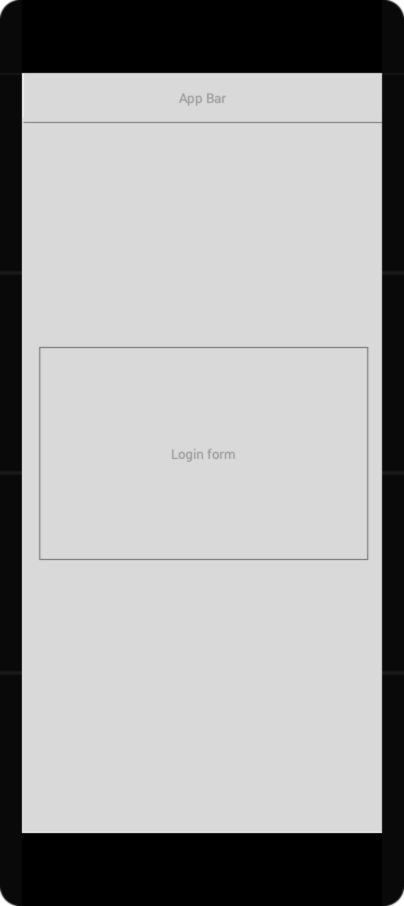
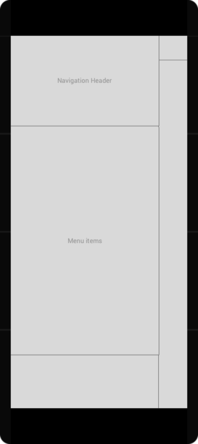
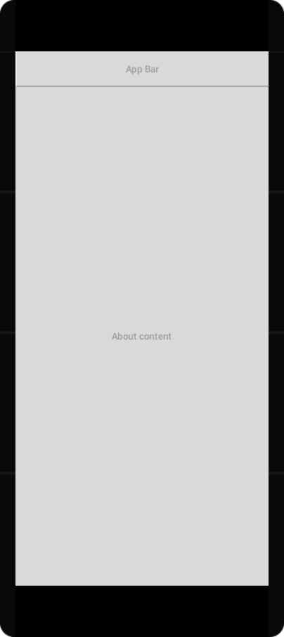
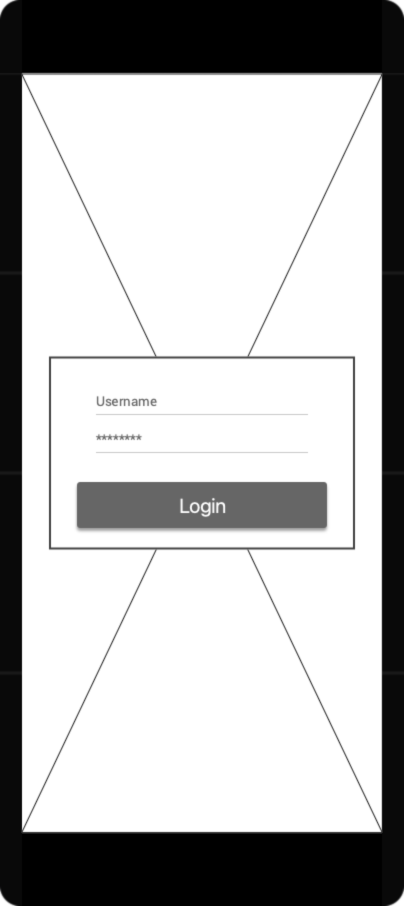
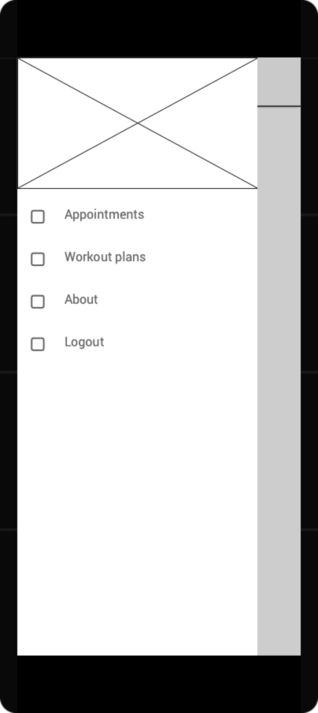
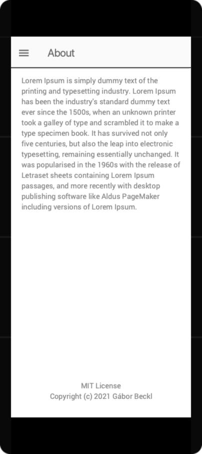

# Specifikáció

## Bevezetés

### Projekt ötlet

Saját időpontok és edzéstervek megtekintése a [PTMA](https://ptma-test.herokuapp.com/) alkalmazásból (időpontfoglaló
webes alkalmazás).

### Legfontosabb cél

4+1 képernyős: 2 listázó, egy részletező, egy bejelentkező és egy rólunk nézet. PTMA publikus API-jának használata, és adatok lokális tárolása.

### Platform

Natív android alkalmazás kotlin nyelven min. 26-os API verzióval.

### Támogatott nyelv

Angol

### Kreatív design

Nincs megadott design. Content és Lo-Fi wireframe-ek készülnek a JustInMind alkalmazással.

### Szállítási határidő

14. hét (2021. 05. 14.)

---

## Általános követelmények

### Képernyőtervek (Content wireframe)

|  |  |  |
|:--:|:--:|:--:|
| *Login screen* | *Navigation* | *Appointment list screen* |

|  |  |  |
|:--:|:--:|:--:|
| *Workout list screen* | *Workout detail screen* | *About screen* |

### Képernyőtervek (Lo-Fi wireframe)

|  |  |  |
|:--:|:--:|:--:|
| *Login screen* | *Navigation* | *Appointment list screen* |

|  |  |  |
|:--:|:--:|:--:|
| *Workout list screen* | *Workout detail screen* | *About screen* |

### Eszköz típus

Telefon-ra készül az alkalmazás, és álló módra lesz optimalizálva.

### Online/Offline

Offline megtekinthetők a korábban betöltött adatok.

### Backend kapcsolat

Kommunikáció a PTMA szerverével JWT autentikációval https-en keresztül.

---

## Specifikus követelmények

### Képernyők részletes leírása

#### Login

A bejelentkező felület, ahol az email cím és jelszó megadásával lehet belépni.

#### About

Néhány soros információ az alkalmazásról, a fejlesztőről és a szoftver licenszéről.

#### Appointment list

A Trainer időpontjait jeleníti meg egy listában. A lista elemei tartalmazzák a helyszínt, a vendéget, az időpont státuszát és a pontos időintervallumot.

#### Workout plan list

Az edzéstervek megjelenítése egy listában. Az elemekben megtalálható az edzésterv elnevezése, hozzá tartozó izomcsoportok és az időtartam.

#### Workout plan detail

Az edzésterv részletező nézetének fejlécében megjelennek az edzésterv adatai (név, izomcsoportok, időtartam), és egy listában a hozzá tartozó gyakorlatok. A gyakorlatok tartalmaznak egy elnevezést, leírást és időtartamot, illetve tartalmazhatnak sorozat és ismétlés számot is.

### Navigáció

Az alkalmazás megnyitásakor a login képernyő jelenik meg. A belépés után az oldalsó menüból választhatjuk ki a képernyőket (Appointments, Workout plans, About), amik között szabadon léphetünk.
Az edzéstervek listájából egy elemre kattintva a részletező képernyőre navigálunk, ahol visszanavigálással térünk vissza a listázó oldalra.
A Logout gombra kattintva visszatérünk a bejelentkező képernyőre.

---

## Use-case diagramm

[comment]: <> ''

## User story-k

- Trainer bejelentkezik a login oldalon az email címét és jelszavát megadva a Sign in gombra kattintva
- Trainer megnyitja a rólunk oldalt az oldalsó menüből az About gombbal
- Trainer megnyitja az időpontok oldalt az oldalsó menüből az Appointments gombbal
- Trainer az időpontok listáját frissíti a pull-to-refresh segítségével
- Trainer megnyitja az edzéstervek oldalt az oldalsó menüből a Workout plans gombra kattintva
- Trainer az edzéstervek listáját frissíti a pull-to-refresh segítségével
- Trainer az edzéstervek listájából egy elemre kattintva megnyitja a részletező oldalt
- Trainer az edzésterv részletek oldalt frissíti a pull-to-refresh segítségével
- Trainer kijelentkezik az alkalmazásból az oldalsó menüből a Logout gombra kattintva
